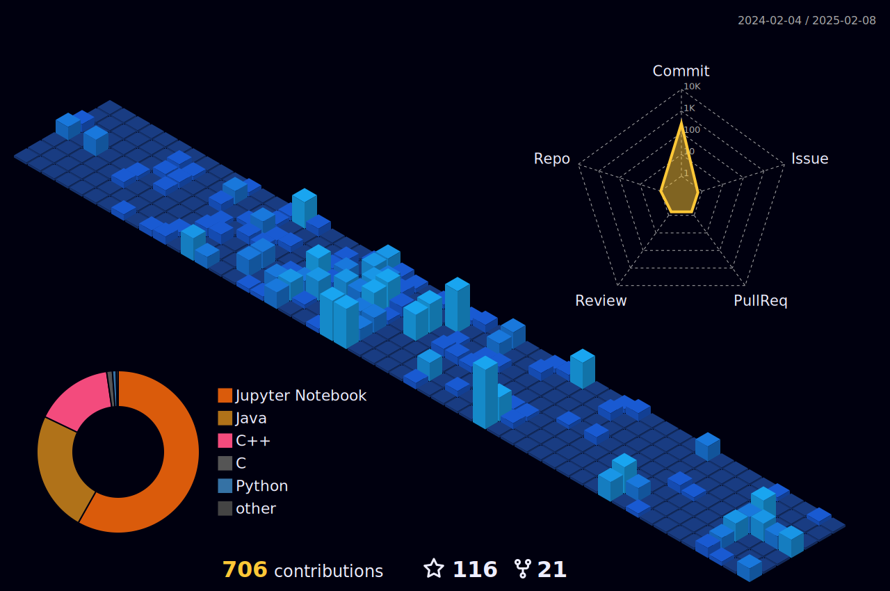

<!-- banner image -->

<!-- profile views -->

  

<h1 align="center">Hi 👋, I'M SWATADRU PAUL</h1>

<!-- Typing Animation -->

  

---

<h3 align="center">🔗 Connect with me 🌏</h3>

  

  

  

  

  

  

---

<h2 align="center">🏆 GitHub Trophies 🥇</h2>

 

---

<h2 align="center">👨‍💻 About Me</h2>

  

- 🎓 Student at **University of Engineering & Management, Kolkata**
- 🚀 Aspiring **Software Development Engineer (SDE)**
- 🌱 Currently learning **Java, C, Python, AI/ML, Web & App Development**
- 💬 Ask me about **Python & Problem Solving**
- 👨‍💻 Portfolio: [Visit Here](https://my-portfolio-eight-mocha-69.vercel.app/)
- 📫 Email: **swatadru.paul2023@uem.edu.in**
- 📄 Resume: [Click Here](https://my-portfolio-eight-mocha-69.vercel.app/#resume)

---

<h2 align="center">📈 GitHub Stats 📊</h2>

  
  
    
  

---

<h2 align="center">📊 Coding Stats 📈</h2>

  

---

<h2 align="center">⚡ Skills & Tools</h2>

<table>
<tr>
<td align="center" width="260">

### 💻 Languages  

</td>
<td align="center" width="260">

### 🌐 Frontend  

</td>
</tr>

<tr>
<td align="center" width="260">

### ⚡ Frameworks  

</td>
<td align="center" width="260">

### 🗄 Databases  

</td>
</tr>

<tr>
<td align="center" width="260">

### ⚙ Tools  

</td>
<td align="center" width="260">

### 🤖 IoT  

</td>
</tr>
</table>

---

<!--<h2 align="center">🎵 Spotify Now Playing</h2>

  

--- -->

<h2 align="center">📈 GitHub Activity Graph</h2>

  

---

<h2 align="center">🐍 Contribution Snake</h2>

  

---

<h2 align="center">➕ Contributions 3D</h2>

  

---

  

