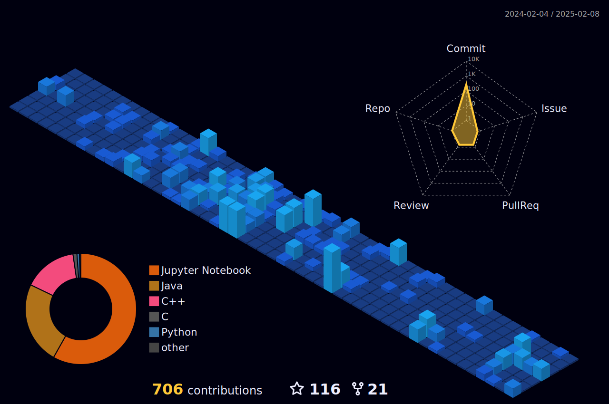

<!-- banner image -->

<!-- profile views -->

  

<h1 align="center">Hi 👋, I'M SWATADRU PAUL</h1>

<!-- Typing Animation -->

  

---

<h3 align="center">🔗 Connect with me 🌏</h3>

  
  
  
  
  
  

---

<h2 align="center">👨‍💻 About Me</h2>

  

- 🎓 Final Year **B.Tech CSE** student at **Institute of Engineering & Management, Kolkata** (CGPA: 8.07)
- 🚀 Aspiring **Software Development Engineer (SDE)** targeting product-based companies
- 🤖 Building **AI-powered full-stack & mobile apps** — React Native, Node.js, Gemini AI, PostgreSQL
- 🔬 **NLP Researcher** — working on AI-driven recipe generation using GPT fine-tuning, LoRA & BRIO
- 🛠️ Creator of **NEO** — a Jarvis-style AI assistant with OS-level automation & real-time web search
- 💬 Ask me about **Python, DSA, System Design & AI/ML**
- 👨‍💻 Portfolio: [Visit Here](https://react-portfolio-vz4c.vercel.app/)
- 📫 Email: **swatadru.paul6539@gmail.com**
- 📄 Resume: [Click Here](https://react-portfolio-vz4c.vercel.app/#resume)

---

<h2 align="center">🚀 Featured Projects</h2>

<table>
<tr>

<td width="33%" align="center">

### 🏥 MediResQ
**Real-time Emergency Medical Response App**

Cross-platform mobile app connecting patients with doctors in real time. Features JWT auth, Stripe payments, Prisma ORM, and AI-powered triage via Gemini AI.

</td>

<td width="33%" align="center">

### 🍳 The Omniscient Sous-Chef
**AI-Driven Recipe Generation & NLP Research**

NLP research system using LoRA fine-tuning & BRIO on RecipeNLG. Features a Food-Chemistry Knowledge Graph, Culturally-Aware Allergen RAG pipeline & adaptive replanning.

</td>

<td width="33%" align="center">

### 🤖 LLM AI Shell Assistant
**Natural Language to Shell Command Executor**

OS-level AI assistant that converts natural language queries into executable shell commands using Gemini AI. Supports real-time automation, error recovery & safe execution.

</td>

</tr>
</table>

---

<h2 align="center">🏆 GitHub Trophies 🥇</h2>

 

---

<h2 align="center">📈 GitHub Stats 📊</h2>

  
  
    
  

---

<h2 align="center">📊 Coding Stats 📈</h2>

  

---

<h2 align="center">⚡ Skills & Tools</h2>

<table>
<tr>
<td align="center" width="260">

### 💻 Languages

</td>
<td align="center" width="260">

### 🌐 Frontend

</td>
</tr>

<tr>
<td align="center" width="260">

### ⚡ Frameworks & Mobile

</td>
<td align="center" width="260">

### 🗄 Databases

</td>
</tr>

<tr>
<td align="center" width="260">

### ⚙ Tools & DevOps

</td>
<td align="center" width="260">

### 🤖 AI / ML

</td>
</tr>
</table>

---

<h2 align="center">📈 GitHub Activity Graph</h2>

  

---

<h2 align="center">🐍 Contribution Snake</h2>

  

---

<h2 align="center">➕ Contributions 3D</h2>

  

---

  

